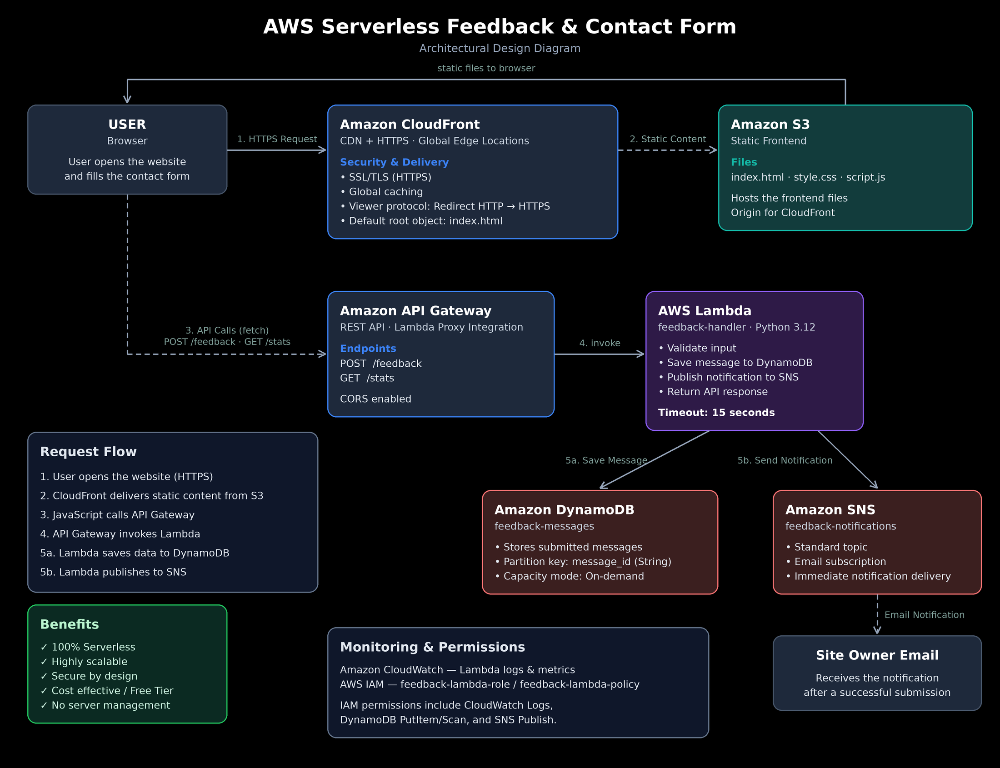

# 💬 Serverless Feedback & Contact Form

> A fully-serverless, cloud-native contact form — no EC2, no servers. HTTPS delivery via CloudFront, backend logic via API Gateway and Lambda, data storage via DynamoDB, and real-time email alerts via SNS.

## Table of Contents
- [Overview](#overview)
- [Architecture](#architecture)
- [Features](#features)
- [Live Test Result](#live-test-result)
- [Skills Demonstrated](#skills-demonstrated)
- [Security Improvement Over Reference Design](#security-improvement-over-reference-design)
- [Possible Improvements](#possible-improvements)
- [Cost Management](#cost-management)
- [Repository Structure](#repository-structure)

## Overview

Users submit a message through a web form. The message is validated, saved to DynamoDB, and the site owner gets an instant email notification — all without managing a single server.

Every component below was designed, deployed, and verified by hand on a personal AWS account. Full step-by-step build log is in [`STEPS.md`](STEPS.md); design rationale for each decision is in [`CONCEPTS.md`](CONCEPTS.md).

## Architecture

| Layer | Service | Purpose |
|---|---|---|
| Frontend delivery | S3 (private) + CloudFront | Static site served over HTTPS, origin locked to CloudFront only |
| API | API Gateway (REST) | `POST /feedback`, `GET /stats` |
| Compute | Lambda (Python 3.12) | Validates input, writes to DynamoDB, publishes to SNS |
| Storage | DynamoDB | Stores submitted messages (on-demand capacity) |
| Notifications | SNS | Emails the site owner on every new submission |
| Security | IAM Role (least privilege) | Lambda permissions scoped to exact resource ARNs |

Region: `us-east-1`

## Features

- **Real-time submission** with client and server-side validation
- **Instant email notification** to the site owner via SNS
- **Live message counter** on the page
- **HTTPS everywhere** via CloudFront
- **100% serverless** — zero EC2, zero servers, zero idle compute cost

## Live Test Result

Successfully submitted a feedback message end-to-end — saved to DynamoDB, triggered an SNS email notification, and updated the live counter on the page.

## Skills Demonstrated

- Serving a static site securely from a private S3 bucket using CloudFront Origin Access Control
- Writing least-privilege IAM policies, including handling a service (SNS) that doesn't support resource-level restriction on all actions
- Input validation and sanitization on both client and server side
- Restricting CORS to a specific origin instead of a wildcard
- Designing graceful degradation — a failed SNS notification doesn't fail the user's request, since the message is already safely stored

## Security Improvement Over Reference Design

The original reference design made the S3 bucket public (`Block all public access` disabled, with a bucket policy allowing `Principal: *`). This project instead uses **CloudFront Origin Access Control (OAC)**:

- The S3 bucket stays fully private — `Block all public access` remains **on**
- Only CloudFront can read from the bucket, via a scoped bucket policy generated by AWS
- Anyone trying to access the S3 URL directly gets `Access Denied`
- CORS is restricted to the actual CloudFront domain instead of `*`

Same functionality, meaningfully smaller attack surface.

## Possible Improvements

- **Infrastructure as Code** — Terraform for repeatable deployments
- **Rate limiting** on API Gateway to prevent spam submissions
- **AWS WAF** in front of CloudFront for basic abuse protection
- **Spam filtering** using Amazon Comprehend on incoming messages
- **Admin dashboard** with Cognito authentication to review submissions

## Cost Management

This architecture is 100% serverless — there are no EC2 instances or load balancers billed by the hour. Every service used (S3, CloudFront, API Gateway, Lambda, DynamoDB, SNS) has an always-free tier or near-zero idle cost, so all resources were left running after testing.

## Repository Structure

    AWS-Serverless-Feedback-Form-Project/
    ├── README.md
    ├── STEPS.md              # Full step-by-step build log
    ├── CONCEPTS.md           # Design rationale for each decision
    ├── screenshots/
    ├── code/
    │   ├── lambda/lambda_function.py
    │   └── frontend/
    │       ├── index.html
    │       ├── style.css
    │       └── script.js
    └── iam/feedback-lambda-policy.json
