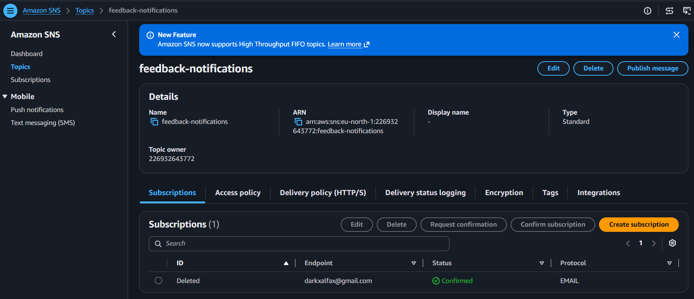
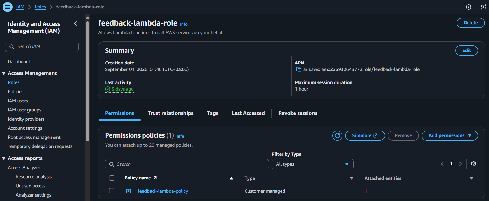
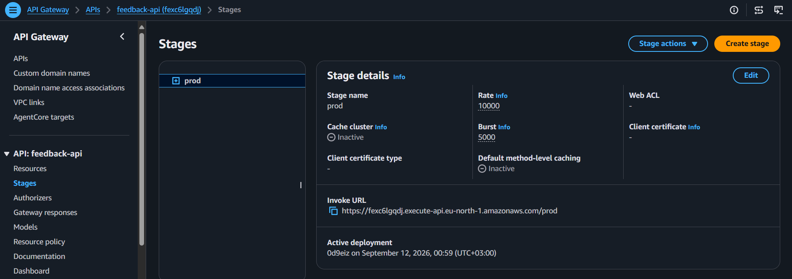
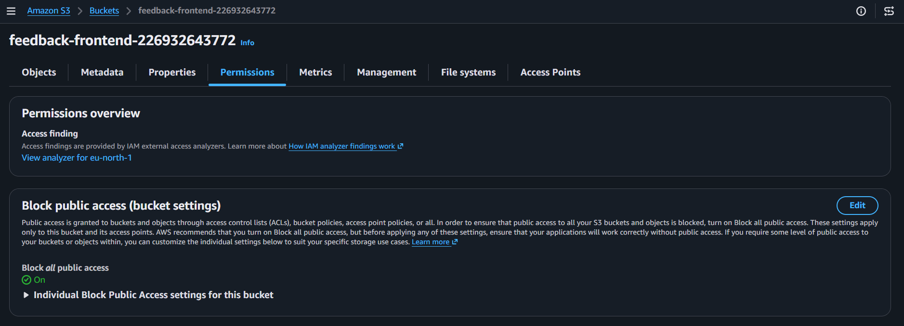
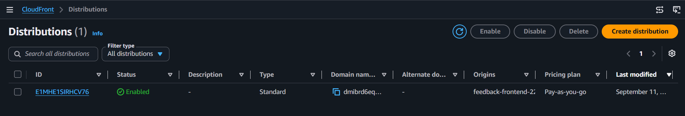
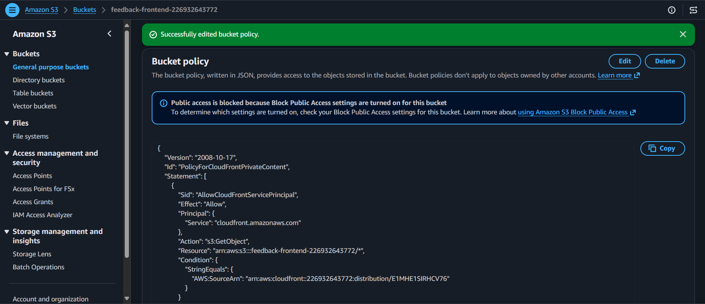
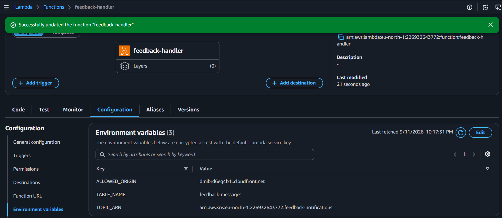
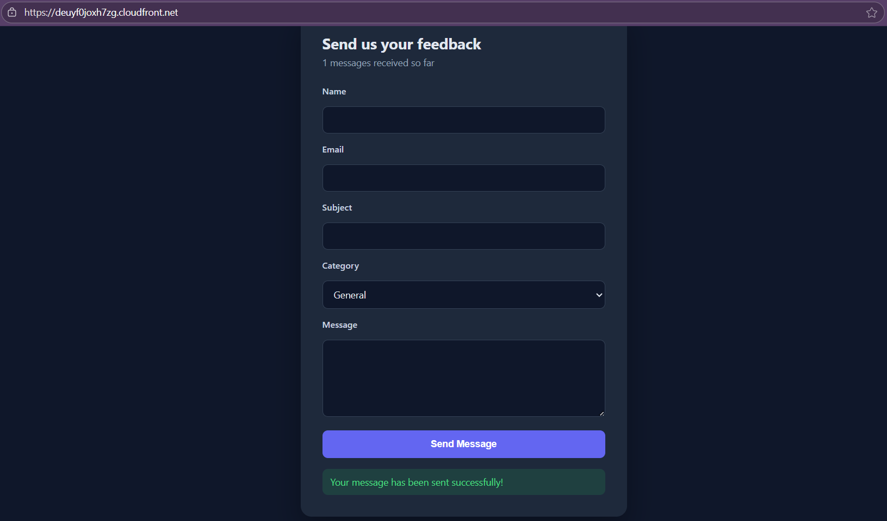
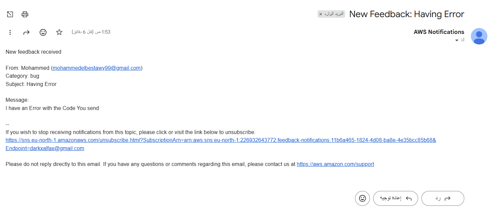
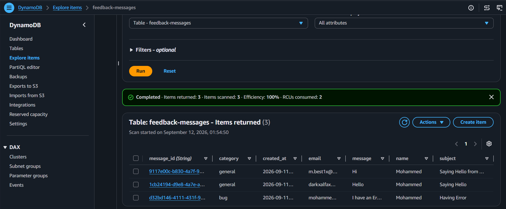

<a id="top"></a>

# 🛠️ Build Log — Serverless Feedback Form

A step-by-step record of every resource created, exactly as configured, plus the security improvement made over the reference design.

## 📋 Quick Navigation

| Step | Section |
|---|---|
| 1 | [🗃️ DynamoDB Table](#step-1) |
| 2 | [📣 SNS Topic & Subscription](#step-2) |
| 3 | [🔐 IAM Role & Policy](#step-3) |
| 4 | [⚡ Lambda Function](#step-4) |
| 5 | [🔌 API Gateway](#step-5) |
| 6 | [🛠️ Frontend Config](#step-6) |
| 7 | [🪣 S3 Bucket (Private)](#step-7) |
| 8 | [🌍 CloudFront + OAC](#step-8) |
| 9 | [🔒 CORS Restriction](#step-9) |
| 10 | [✅ End-to-End Test](#step-10) |

---

<a id="step-1"></a>
## Step 1 — 🗃️ DynamoDB Table

This is the database that stores every submitted message.

| Setting | Value |
|---|---|
| Name | `feedback-messages` |
| Partition key | `message_id` (String) |
| Capacity mode | On-demand |

---

<a id="step-2"></a>
## Step 2 — 📣 SNS Topic & Subscription

This sends an instant email to the site owner whenever a new message comes in.

| Setting | Value |
|---|---|
| Topic name | `feedback-notifications` |
| Type | Standard |
| Subscription protocol | Email |
| Subscription status | Confirmed |




---

<a id="step-3"></a>
## Step 3 — 🔐 IAM Role & Policy

These are the exact permissions the Lambda function needs — nothing more than what it actually uses.

```json
{
  "Version": "2012-10-17",
  "Statement": [
    {
      "Effect": "Allow",
      "Action": [
        "logs:CreateLogGroup",
        "logs:CreateLogStream",
        "logs:PutLogEvents"
      ],
      "Resource": "*"
    },
    {
      "Effect": "Allow",
      "Action": [
        "dynamodb:PutItem",
        "dynamodb:Scan"
      ],
      "Resource": "arn:aws:dynamodb:*:*:table/feedback-messages"
    },
    {
      "Effect": "Allow",
      "Action": "sns:Publish",
      "Resource": "*"
    }
  ]
}
```

> ⚠️ **Note:** `sns:Publish` is scoped to `*` instead of a specific topic ARN. This isn't a design choice — SNS doesn't support resource-level restriction on `Publish` the way S3 and DynamoDB support restricting actions to a specific bucket or table ARN. It's a service limitation, not a looser policy.



---

<a id="step-4"></a>
## Step 4 — ⚡ Lambda Function

This function validates the incoming message, saves it to DynamoDB, and publishes a notification to SNS.

| Setting | Value |
|---|---|
| Name | `feedback-handler` |
| Runtime | Python 3.12 |
| Role | `feedback-lambda-role` |
| Env vars | `TABLE_NAME`, `TOPIC_ARN`, `ALLOWED_ORIGIN` |
| Timeout | 15 sec |

Full code: [`code/lambda/lambda_function.py`](code/lambda/lambda_function.py)

Key hardening over the reference implementation:
- Errors are logged to CloudWatch, never returned to the client
- Category field is validated against a fixed whitelist
- Message length is capped to prevent oversized payloads
- A failed SNS publish doesn't fail the whole request — the message is already saved

---

<a id="step-5"></a>
## Step 5 — 🔌 API Gateway

This is the link between the frontend form and the Lambda function.

| Setting | Value |
|---|---|
| API name | `feedback-api` (REST, Regional) |
| Resources | `POST /feedback`, `GET /stats` |
| Integration | Lambda proxy + CORS enabled |
| Stage | `prod` |



---

<a id="step-6"></a>
## Step 6 — 🛠️ Frontend Config

Updated `script.js` locally with the real API Gateway Invoke URL from Step 5, before uploading the frontend files to S3.

---

<a id="step-7"></a>
## Step 7 — 🪣 S3 Bucket (Private)

This is where the static frontend files live — kept fully private, unlike the reference design.

| Setting | Value |
|---|---|
| Name | `feedback-frontend-<account-id>` |
| Region | us-east-1 |
| Block all public access | **On** |
| Static website hosting | Not enabled |



---

<a id="step-8"></a>
## Step 8 — 🌍 CloudFront + Origin Access Control

This is the CDN that delivers the site over HTTPS, and the only thing allowed to read from the S3 bucket.

| Setting | Value |
|---|---|
| Origin | S3 bucket (private, via OAC) |
| Origin access | Origin Access Control (OAC) |
| Viewer protocol policy | Redirect HTTP to HTTPS |
| Default root object | `index.html` |

**Issue avoided:** the reference design makes the bucket public and relies on a wildcard bucket policy (`Principal: *`). This project uses OAC instead — the bucket policy only trusts the CloudFront distribution itself, so direct S3 URL access returns `Access Denied`.




---

<a id="step-9"></a>
## Step 9 — 🔒 CORS Restriction

Updated the Lambda's `ALLOWED_ORIGIN` environment variable from `*` to the real CloudFront domain, so only this site's frontend can call the API.



---

<a id="step-10"></a>
## Step 10 — ✅ End-to-End Test

A final check to confirm every piece works together.

1. Opened the CloudFront URL — form loaded correctly.
2. Submitted a real feedback message.
3. Confirmed the email notification arrived via SNS.
4. Confirmed the message was saved in DynamoDB.
5. Confirmed the message counter updated on the page.

| Check | Result |
|---|---|
| Form submission | ✅ Success message shown |
| Email notification | ✅ Received |
| DynamoDB record | ✅ Saved |
| Live counter | ✅ Updated |





---

<div align="center">

**[⬆ Back to top](#top)**

</div>
